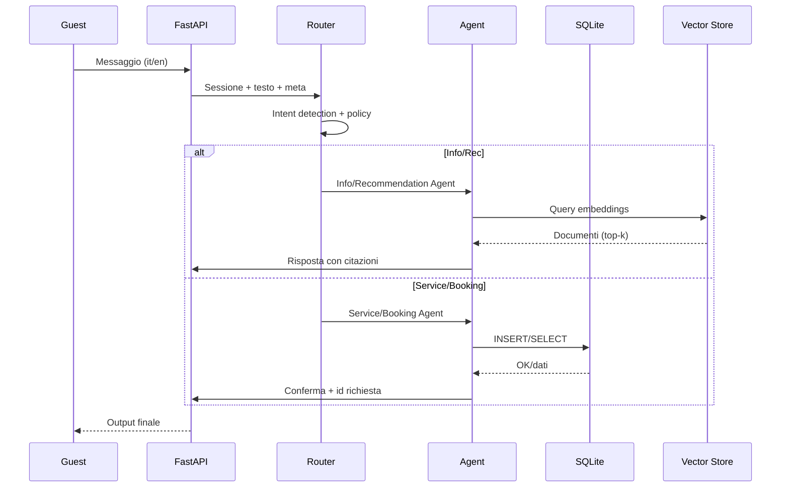

# Assistente Virtuale per Hotel Concierge — Documento di Design (TASK 1)

## 1) Architettura del sistema

- Componenti
  - Frontend chat (web/mobile) o CLI di test
  - API/Router (FastAPI): sessioni, auth guest, locale detection
  - Orchestrator/Router (LangChain): intent routing + policy
  - Agent/Chain:
    - Info Agent (RAG su knowledge base)
    - Service Request Agent (crea/traccia ticket)
    - Recommendation Agent (RAG + preferenze + feedback)
    - Booking Agent (prenotazioni spa/ristorante/transfer)
    - Handoff/Emergency Agent (escalation a personale)
  - Tooling:
    - SQLite (prenotazioni/richieste/feedback)
    - Vector store (FAISS/Chroma) su KB hotel/città
    - Notifiche (email/webhook/Slack simulabile)
    - Telemetry/Logs

```mermaid path=null start=null
graph LR
  U[Utente/Guest] -->|Chat| FE[Frontend Chat]
  FE --> API[FastAPI Gateway]
  API --> ORCH[Orchestrator/Router (LangChain)]
  ORCH -->|intent: info| IA[Info Agent (RAG)]
  ORCH -->|intent: service| SRA[Service Request Agent]
  ORCH -->|intent: recommend| RA[Recommendation Agent]
  ORCH -->|intent: booking| BA[Booking Agent]
  ORCH -->|intent: emergency/handoff| HA[Handoff/Emergency Agent]

  IA --> RET[Retriever (Vector Store)]
  RA --> RET
  BA --> DB[(SQLite)]
  SRA --> DB
  HA --> NOTIF[Notifiche (Slack/Email/Webhook)]

  RET --> KB[(KB Hotel+Città JSON/CSV)]
  ORCH --> LOG[Logging/Telemetry]
```

- Flusso delle informazioni (tipico)
  1) Messaggio → API → Orchestrator (LLM Router)
  2) Recupero contesto (sessione, lingua, booking attivo)
  3) Invocazione Agent corretto + Tool necessari (DB, Retriever)
  4) Validazione/estrazione parametri → scrittura/lettura su SQLite
  5) Composizione risposta + citazioni KB (se RAG) + eventuali notifiche
  6) Persistenza evento e risposta per tracciabilità



- Tecnologie
  - Python 3.9+, LangChain, FastAPI (router), Pydantic (validation), SQLite (via `sqlite3` o `SQLAlchemy`), FAISS/Chroma (vector store), OpenAI/Anthropic (simulabile), `scikit-learn`/`rapidfuzz` per ranking ibrido (opzionale)

## 2) Definizione degli Agent/Chain e routing

- Orchestrator/Router
  - LLM Router con schema Pydantic: intents = info, service_request, recommendation, booking, emergency, unknown
  - Regole hard per parole chiave critiche (es. “incendio”, “sangue”, “furto”) → emergency override
  - Memory: finestra conversazionale + stato sessione (lingua, booking attivo, preferenze)
  - Guardrails: limiti PII, filtri contenuti

- Info Agent (RAG)
  - Prompt con istruzioni hotel, stile conciso, lingua rilevata
  - Retriever: Ensemble (BM25 + dense) o MultiQueryRetriever
  - Output con citazioni (top-3) e confidenza

- Service Request Agent
  - Estrae slot: camera, tipo richiesta (room service/pulizie/manutenzione), orario, priorità
  - Valida campi, crea ticket in `service_requests`, restituisce `service_request_id`
  - Auto-prioritization: manutenzione critica → alta priorità

- Recommendation Agent
  - RAG su KB città (ristoranti/attrazioni/trasporti) + filtri (distanza, budget, cucina)
  - Personalizzazione: preferenze guest + feedback storico (tabella `recommendation_feedback`)
  - Ordina con MMR + punteggio di affinità preferenze

- Booking Agent
  - Spa/Ristorante/Transfer: raccoglie slot (data/ora, pax, note), verifica conflitti, scrive in `reservations`
  - Simula disponibilità (tabella risorse o policy di finestra temporale)

- Handoff/Emergency Agent
  - Casi complessi/ambigui o emergenze → crea record `staff_escalations` e invia notifica
  - Fornisce messaggio sicuro all’ospite e tempo stimato di risposta

- Interazione tra agent
  - Router → Agent primario; se servono info aggiuntive, l’Agent può:
    - Chiedere chiarimenti all’utente (slot-filling)
    - Consultare DB/KB
    - Delegare ad altro Agent via sottorouting (es. Rec → Booking)

- Logica di routing
  - Priorità: emergency > service_request (critico) > booking > recommendation > info > unknown
  - Confidence threshold: se bassa → richiesta chiarimento o fallback a Info Agent con RAG

## 3) Schema del Database (SQLite)

- Principali tabelle
  - guests, rooms, bookings
  - service_requests (ticket di servizio)
  - reservations (spa/ristorante/transfer)
  - recommendation_feedback (personalizzazione)
  - staff_escalations (handoff umano)

```sql path=null start=null
CREATE TABLE guests (
  id INTEGER PRIMARY KEY,
  full_name TEXT NOT NULL,
  email TEXT UNIQUE,
  phone TEXT,
  preferred_language TEXT CHECK(preferred_language IN ('it','en')) DEFAULT 'it'
);

CREATE TABLE rooms (
  room_number TEXT PRIMARY KEY,
  floor INTEGER,
  room_type TEXT,
  status TEXT DEFAULT 'occupied' -- or 'vacant', 'maintenance'
);

CREATE TABLE bookings (
  id INTEGER PRIMARY KEY,
  guest_id INTEGER NOT NULL REFERENCES guests(id),
  room_number TEXT REFERENCES rooms(room_number),
  check_in DATETIME NOT NULL,
  check_out DATETIME NOT NULL,
  notes TEXT
);

CREATE TABLE service_requests (
  id INTEGER PRIMARY KEY,
  guest_id INTEGER REFERENCES guests(id),
  booking_id INTEGER REFERENCES bookings(id),
  room_number TEXT,
  category TEXT CHECK(category IN ('room_service','cleaning','maintenance','other')) NOT NULL,
  description TEXT,
  priority TEXT CHECK(priority IN ('low','medium','high','urgent')) DEFAULT 'medium',
  status TEXT CHECK(status IN ('open','in_progress','done','cancelled')) DEFAULT 'open',
  created_at DATETIME DEFAULT CURRENT_TIMESTAMP,
  scheduled_for DATETIME,
  closed_at DATETIME,
  assigned_to TEXT,
  channel TEXT -- e.g., 'chat'
);

CREATE TABLE reservations (
  id INTEGER PRIMARY KEY,
  booking_id INTEGER REFERENCES bookings(id),
  type TEXT CHECK(type IN ('spa','restaurant','transfer')) NOT NULL,
  target TEXT, -- es. 'Ristorante La Pergola' o 'Spa Room 2' o 'Sedan'
  start_time DATETIME NOT NULL,
  end_time DATETIME,
  pax INTEGER DEFAULT 1,
  notes TEXT,
  status TEXT CHECK(status IN ('pending','confirmed','cancelled')) DEFAULT 'pending',
  created_at DATETIME DEFAULT CURRENT_TIMESTAMP
);

CREATE TABLE recommendation_feedback (
  id INTEGER PRIMARY KEY,
  guest_id INTEGER REFERENCES guests(id),
  item_id TEXT, -- id o slug dal KB
  item_type TEXT, -- 'restaurant','attraction','transport'
  score INTEGER CHECK(score BETWEEN 1 AND 5),
  comment TEXT,
  created_at DATETIME DEFAULT CURRENT_TIMESTAMP
);

CREATE TABLE staff_escalations (
  id INTEGER PRIMARY KEY,
  service_request_id INTEGER REFERENCES service_requests(id),
  reason TEXT,
  level TEXT CHECK(level IN ('concierge','duty_manager','security')),
  status TEXT CHECK(status IN ('open','ack','resolved')) DEFAULT 'open',
  created_at DATETIME DEFAULT CURRENT_TIMESTAMP,
  resolved_at DATETIME
);
```

- Note di modellazione
  - Colonne `preferred_language`, `category`, `priority` normalizzano i flussi
  - `recommendation_feedback` abilita personalizzazione leggera
  - `reservations` generica per tre tipologie con `type` + `target`
  - Indici suggeriti: `(guest_id)`, `(booking_id)`, `(status)`, `(type,start_time)`

## 4) Gestione della Knowledge Base

- Sorgenti: JSON/CSV “Hotel” (servizi, orari, policy), “Città” (ristoranti, attrazioni, trasporti)
- Ingest
  - Parsing → normalizzazione campi (nome, descrizione, tags, orari, prezzo, distanza, lingua)
  - Chunking: 400–800 token, overlap 80–120, per documento tipizzato (hotel|city)
  - Metadata: source, lang, doc_type, section, tags, price_range, distance_km
- Embedding
  - OpenAI text-embedding-3-small o similare (o modello locale se simulato)
  - Cross-lingual: uso dello stesso spazio embedding per it/en
- Retrieval
  - EnsembleRetriever: BM25 (sparse) + dense (k=8–12); MMR per diversità
  - Re-ranking: Reciprocal Rank Fusion o cosine score + prior (doc_type rilevante)
  - Filtri su metadata (es. lang preferita, prezzo, distanza)
- Ranking/Answering
  - Prompt con istruzioni: cita fonti, non inventare, chiedi chiarimenti se mancano dati
  - Soglia confidenza → se bassa: follow-up question o handoff
- Multilingua
  - Language detection all’ingresso (heuristic + LLM)
  - Query translation se store monolingua; idealmente embeddings cross-lingua
  - Risposte nella lingua dell’utente; citazioni invarianti
  - Campi KB con `lang=it/en`; fallback: traduzione on-the-fly per snippet

## 5) Error Handling, Fallback, Escalation

- Scenari di errore principali
  - Intent incerto o slot mancanti → richiesta chiarimenti
  - KB miss o bassa confidenza → fallback informativo generico + handoff opzionale
  - DB indisponibile → risposte temporanee e coda locale (retry)
  - Tool failure (notifiche/API esterne) → retry + log + messaggio utente
  - LLM timeout/rate limit → backoff, provider fallback (Anthropic/OpenAI/simulato)

- Strategie di fallback
  - Prompt fail-safe (“se non sei certo, chiedi domande di disambiguazione”)
  - Risposte conservative con opzioni (“Posso contattare il concierge per te?”)
  - Cache ultimo buon risultato (per info hotel statiche)

- Escalation a personale umano
  - Trigger:
    - emergenze (parole chiave safety/security, guasti gravi)
    - bassa confidenza ripetuta (es. 2 tentativi)
    - richieste out-of-policy (pagamenti, dati sensibili)
    - ospite esplicitamente richiede personale
  - Azione:
    - crea `staff_escalations`, invia notifica (Slack/email), include contesto e trascrizione
    - comunica all’utente ETA e canale di contatto

- Gestione richieste urgenti
  - Emergency Agent prioritario: messaggio rassicurante, istruzioni base (es. evacuazione, chiamata interna), notifica immediata a sicurezza/reception
  - Classificazione “urgent” su `service_requests` per manutenzioni critiche
  - Prevenzione allucinazioni: risposte template, nessun consiglio medico/legale

---

Con questo design, in 2 ore è possibile implementare:
- Router + 3 agent principali (Info, Service, Booking) con tool SQLite e Retriever
- Ingest minimale KB in Chroma/FAISS
- DDL SQLite e endpoints FastAPI essenziali
- Notifiche simulate via log/console o webhook finto
